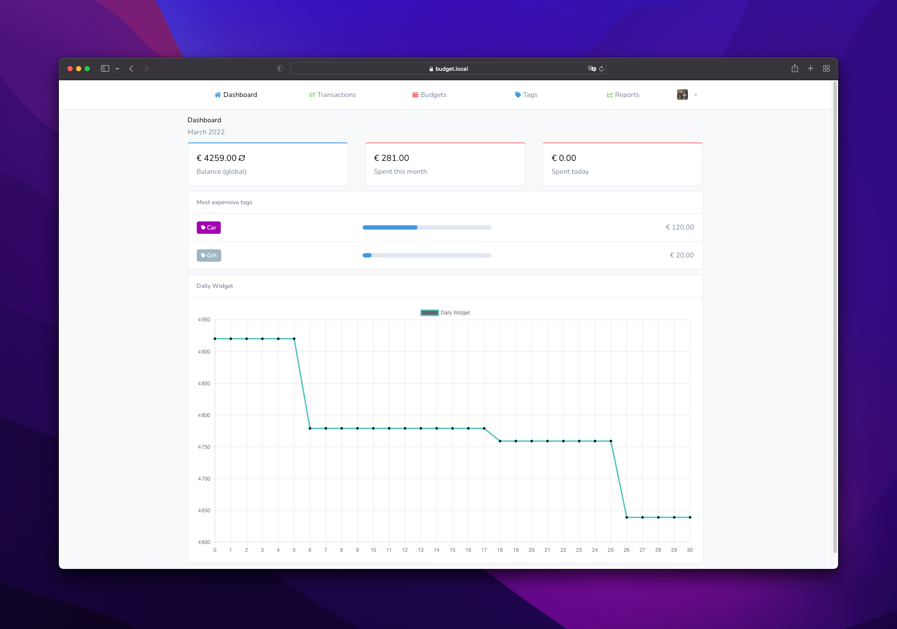

# Budget


[](https://codecov.io/gh/RocketC31/budget)
[](https://github.com/RocketC31/budget/blob/master/LICENSE)

This project is a fork of original project created here : [Budget](https://github.com/range-of-motion/budget)

More time pass, more this fork will be different. You can compare the two project and fork this one who is better for your.
You can see issues github to know what is different in this fork. And where this project going.
You can discuss with me on github's issues if you want more information or other features I wouldn't have thought of.
I will check modifications of original project and merge them if they are usefull for this fork.

Big thanks to [range_of_motion](https://github.com/range-of-motion) and his contributors for this original work that permit to me to have
a good base for update the application on what i imagine.

## Presentation
Budget is an open-source web application that helps you keep track of your finances.

You can use Budget by hosting it yourself.



## Features

* Insertion and management of transactions
* Ability to organize transactions using tags
* Facilitate uploading and organizing of receipts
* Support for importing transactions (CSV format)
* Reports that visualize financials (showing weekly balance and most expensive tags, for example)
* Supports multiple currencies
* Available in multiple languages
* Weekly summary available through e-mail

## Requirements

* PHP 8.0 or higher
* HTTP server (for example Apache or NGINX)
* MySQL
* Composer
* Node.js

## Installation

* Clone the repository (`git clone https://github.com/RocketC31/budget.git`)
    * You should always check out a tag, since the `master` branch might not always be stable (`git checkout TAG`)
* Install dependencies (`composer install --no-dev -o`)
* Run installation command (`php artisan budget:install`)
* Configure additional services in `.env` (database or mail, for example)
* Run migrations for database (`php artisan migrate`)
* Head over to your list of crons (`crontab -e`) and add `* * * * * cd /path-to-budget && php artisan schedule:run >> /dev/null 2>&1`

*Note that in order for certain features to work properly, the jobs queue needs to be watched. This can be done by either running `php artisan queue:work` or using [Supervisor](https://laravel.com/docs/7.x/queues#supervisor-configuration).*

## Updating

Use the command below to update to the latest version.

```
php artisan budget:update
```

## Lang on front
Translations in VueJs is working with [matice librarie](https://github.com/GENL/matice)

If you want to use default lang path of laravel, do that :
```
php artisan vendor:publish --provider="Genl\Matice\MaticeServiceProvider"
```

And edit on `config/matice.php`

```PHP
'lang_directory' => lang_path(),
```

## Additional configuration
Because of some providers have not same configuration. Some configurations can be activate or disabled :

```DOTENV
# For use or not redis. Usefull for widget balance_global who store data into redis
REDIS_AVAILABLE:true
# For server who not have PATCH method available. If set to false, PUT method will be used
PATCH_METHOD_AVAILABLE:true
```

## Docker

You can get set-up with Budget using Docker.

### Do it yourself

If you just want an environment that takes care of the webserver, PHP and database, you should use this option. It will spin up the services required to run Budget, but not do any of the setting up for the application (activities such as installing Composer dependencies or generating an application key).

`docker-compose up -d`

### Automatic

If you want everything to be installed and set-up from start to finish, you should use this option. By providing the `BUDGET_SETUP` environment variable, a script will run that does everything you need–whether it's installing Composer dependencies or compiling front-end assets.

It may take a few minutes before the process is completed and you're able to use Budget.

`BUDGET_SETUP=1 docker-compose up -d`
